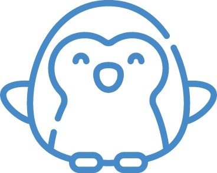
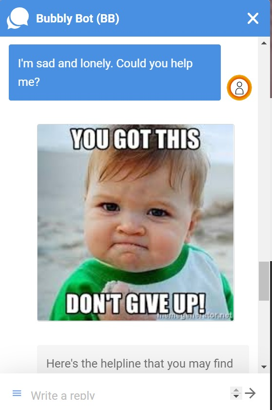
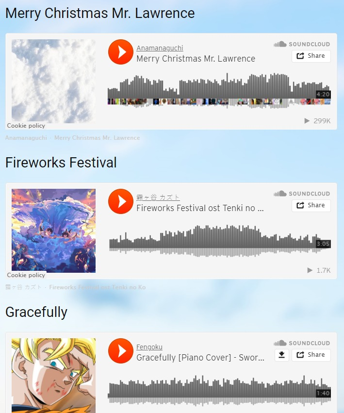
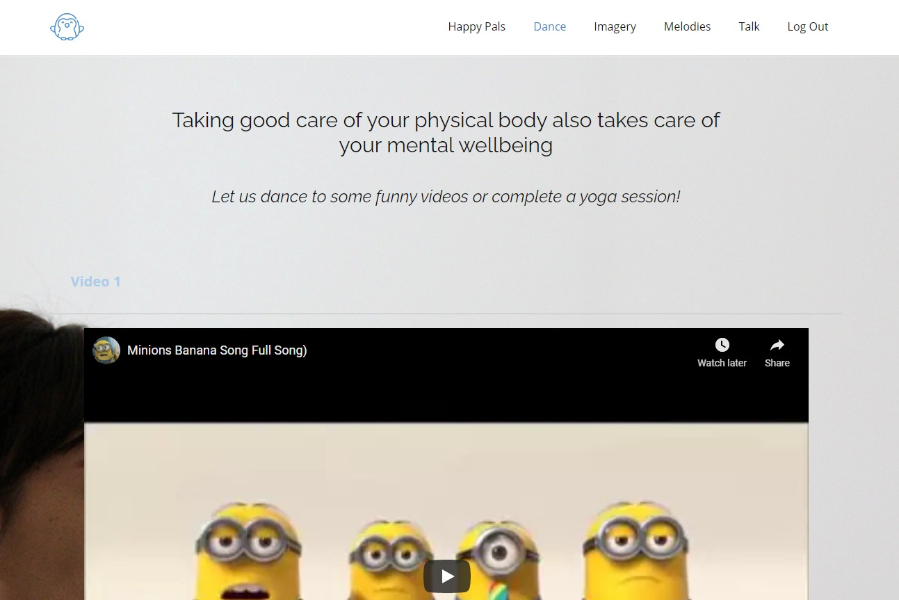
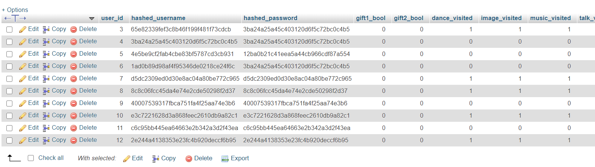
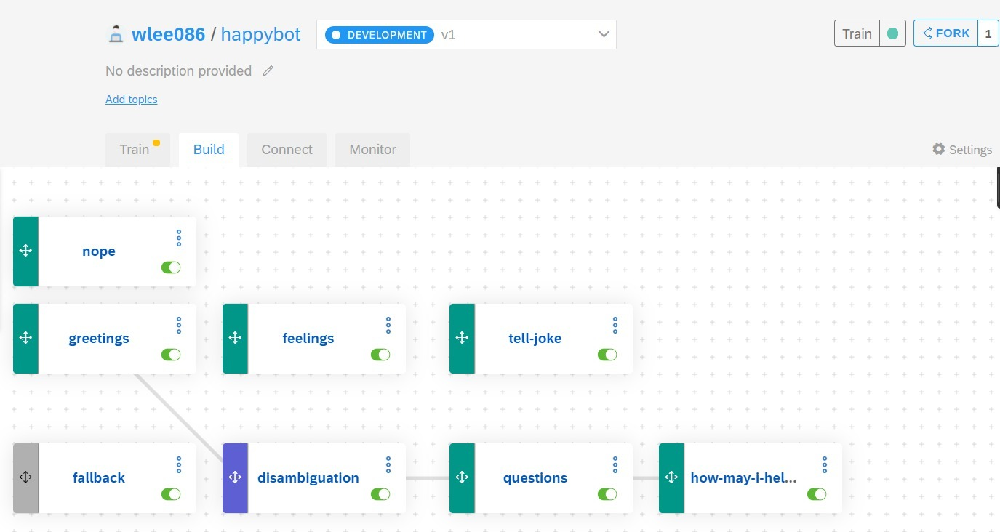

# Happy Pals &nbsp;
https://happy-pals.appspot.com/

#### Proudly presented to you by Team Ekspansyion

COVID-19 has affected every individual’s everyday lifestyle in one way or the other including personal and professional life, mental wellbeing, interaction with families, social life, etc. Some statistics from the World Health Organisation <a href="https://www.who.int/news-room/fact-sheets/detail/adolescent-mental-health">here</a> indicated that half of all mental health conditions start by 14 years of age but most cases are undetected and untreated. At the same time, depression is one of the leading causes of illness and disability among adolescents globally.  

Focusing on the **Mental Health** issue, our team Ekspanyion, consisting of 3 members, *Philip Lee Hann Yung, Lee Wai Yeong* and *Lee Jinhen*, embarked on a journey of a lifetime to play our part in combating this issue by spurring our ideas via the SAP Cloud Track. Using PHP, HTML, CSS and JavaScript, we have developed a web application that caters to the mental wellbeing of our users. Our app showcases many ways to release stress and find out more about your mental health. The integrated chatbot within our web app is developed using SAP's proprietary Conversational AI platform.

Several one-of-its-kind features have been implemented into this web application. These features include imagery meditation, soothing music playlist, fun destressing videos and videos for laughs! Users will find themselves immersed in a sanctuary of calmness. Everybody needs a rest from time to time. To enhance engagement with users, there is a point-based in-game reward system, in which users can exchange accumulated points for a cute plushie.

 

## Table of Contents

1. Features
2. Technical Implementation
3. Future Works
4. Acknowledgments

  

## Features

### Welcome & Login Page

"Life is a first impression. You get one shot at it." As the saying goes, we have customized our welcome page as well as our login page to enhance the user's experience.

### Chatbot - Bubbly Bot 

Bubbly Bot is equipped with basic conversational skills and could sense various emotions from a user, including anger, saddness, happiness or depression. When the user prompts a depression, sad or lonely message, Bubbly Bot will provide emotional and motivational support via motivational quotes and a helpline. Whenver the user is feeling down and under, Bubbly Bot will be there to comfort the user until he/she cheers up, and acts as a companion to support the user through ups and downs.

### Soothing Melodies :saxophone:

Let your body move to the music as you relax and listen to our customized relaxing music playlist!

### Imagery Meditation :deciduous_tree:

Nature at heart, these visuals aim to provide relaxation, meditation and calms you down!

### Just for Laughs/Dance Videos :laughing:

Tune in to our Just for Laughs/Dance videos for a heartful of laughter and endless entertainment!

  
## Technical Implementation

Web Application
- The web app is built using HTML, CSS, Javascript and PHP to handle special interactions with the use.
- It was then deployed on Google Cloud Platform's Compute App Engine to be hosted as a Apache server.
- The MySQL instance on Google Cloud Platform did not interface well with GCP's Compute App Enginer so we ended up using FreeMySQLhosting.net to host the MySQL server.
- Login credentials are stored in their hashed form to ensure that the individual is non-traceable.

AI Chatbot
- The chatbot was build on SAP Cloud using SAP's Conversational AI toolbox. Custom messages were used to train the chatbot so that the chatbot knows to react to emotional keywords and common conversational keywords.
- The bot was trained using various intents and organized the logic behind the bot's responses and a fallback scenario in which the bot is unable to decipher the user's prompt.
- The log feed is utilized to improvise the AI, to improve it accuracy in predicting intent and thus the correct response.
- AI bot integrated onto website via Webchat.

  
## Future Works

- Media resources can be obtained by partnership with govermental organisations that are in charge of mental health
- Add more features like games, proper tracking of the milestones, exercise buddies, improved chatbot logic
- Work hand in hand with mental health professionals to develop more relevant content and resources

  
## Acknowledgements

- We utilized https://nicepage.com/ to build our HTML pages and expedite the design and layout process
- Our sample media used in the web app are sourced from https://soundcloud.com/ and https://www.youtube.com/
